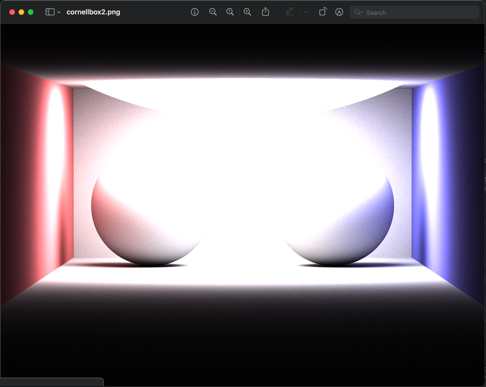
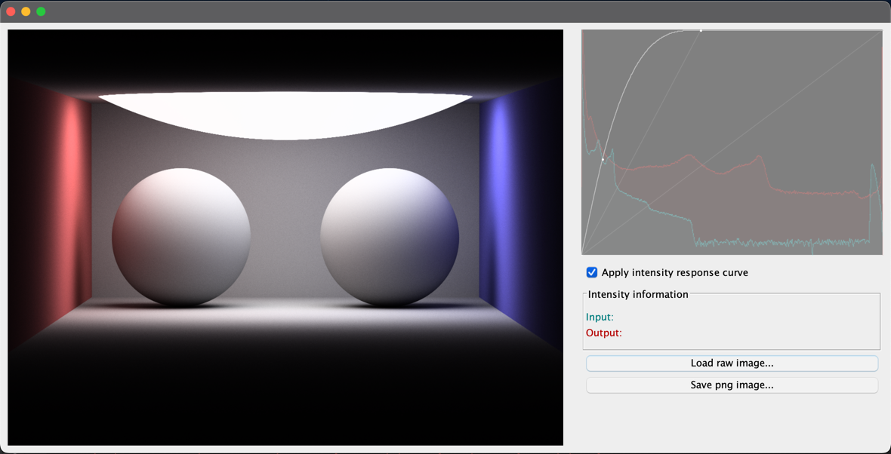

= RawImageEditor

A raw file "editor" for my own raw image file format.

Instead of trying to fix and adjust lights in the path tracing scene to fit neatly in the 8bit (0, 255) range for pixel color channels red, green, and blue respectively.
I decided to save raw image files (my own FIMG file format) with 32bit float values for R, G, and B channels. Keeping the full, or at least a whooping lot better, dynamic intensity range for all rendered pixels.

The images are later post edited in this raw image editor to extract and enhance the wanted tonal range for the image.

It saves a lot of trial and error rendering of 3D scenes as I can just focus on the relative emission output between the lights rather than doing that AND trim them to a perfect exposure fitting for the output 8bit (not so) dynamic range.

.PNG image of a Cornellbox as produced by path tracer using ordinary RGB clamping of color values.

.Imported raw image file for the cornellbox in image editor before editing.
image::documentation/images/ui_notedited.png[alt=Not edited raw file,width=50%,height=50%]

.Imported raw image file for the cornellbox in image editor after brightness adjustment using response curve (with histogram support) .

== FIMG file format

The specification for the FIMG, the float image file format:

  * xref:documentation/fimg_file_format_v1.0.adoc[FIMG v1.0]
  * xref:documentation/fimg_file_format_v2.0.adoc[FIMG v2.0]

Write FIMG image files using golang:

  * xref:documentation/write_fimg_golang_v1.0.adoc[Write FIMG v1.0 image file]
