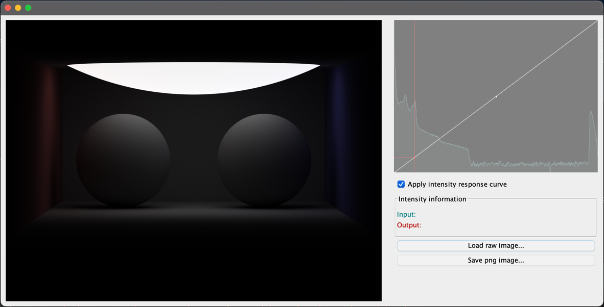

# RawImageEditor

A raw file "editor" for my own raw image file format.

Instead of trying to fix and adjust lights in the path tracing scene to fit neatly in the 8bit (0, 255) range for pixel color channels red, green, and blue respectively.
I decided to save raw image files with 32bit float values for R, G, and B channels. Keeping the full, or at least a whooping lot better, dynamic intensity range for all rendered pixels.

The images are later post edited in this raw image editor to extract and enhance the wanted tonal range for the image.

It saves a lot of trial and error rendering of 3D scenes as I can just focus on the relative emission output between the lights rather than doing that AND trim them to a perfect exposure fitting for the output 8bit (not so) dynamic range.

.PNG image of a Cornellbox as produced by path tracer using ordinary RGB clamping of color values.

.Imported raw image file for the cornellbox in image editor before editing.

.Imported raw image file for the cornellbox in image editor after brightness adjustment using response curve (with histogram support) .

## Raw image file format

Simple enough:

.Image file header
|===
|Data format |Value

|32bit big endian integer |File format major version
|32bit big endian integer |File format minor version

|32bit big endian integer |Image width in pixels
|32bit big endian integer |Image height in pixels
|===

.Image pixel data, pixel by pixel starting at top left and then from left to right, top line to bottom line. Each pixels R,G, and B values in a long 32 bit float stream.
|===
|Data format |Value

|32bit big endian float |R value of RGB. Value range from 0.0 and up (no limit).
|32bit big endian float |G value of RGB. Value range from 0.0 and up (no limit).
|32bit big endian float |B value of RGB. Value range from 0.0 and up (no limit).
|===

.RawImage file format (pseudo code in go lang)
[source,go]
----
type Color struct{ R, G, B float32 }

type FloatImage struct {
    name   string
    pixels []color.Color
    Width  int
    Height int
}

func WriteRawImage(image *FloatImage) {
    var byteBuffer bytes.Buffer

    fileFormatVersionMajor := 1
    fileFormatVersionMinor := 0

    writeBinaryInt32BigEndian(&byteBuffer, int32(fileFormatVersionMajor))
    writeBinaryInt32BigEndian(&byteBuffer, int32(fileFormatVersionMinor))
    writeBinaryInt32BigEndian(&byteBuffer, int32(image.Width))
    writeBinaryInt32BigEndian(&byteBuffer, int32(image.Height))

    binary.Write(&byteBuffer, binary.BigEndian, image.pixels)
}

func writeBinaryInt32(buffer *bytes.Buffer, value int32) {
	if err := binary.Write(buffer, binary.BigEndian, value); err != nil {
		fmt.Println(err)
	}
}
----

